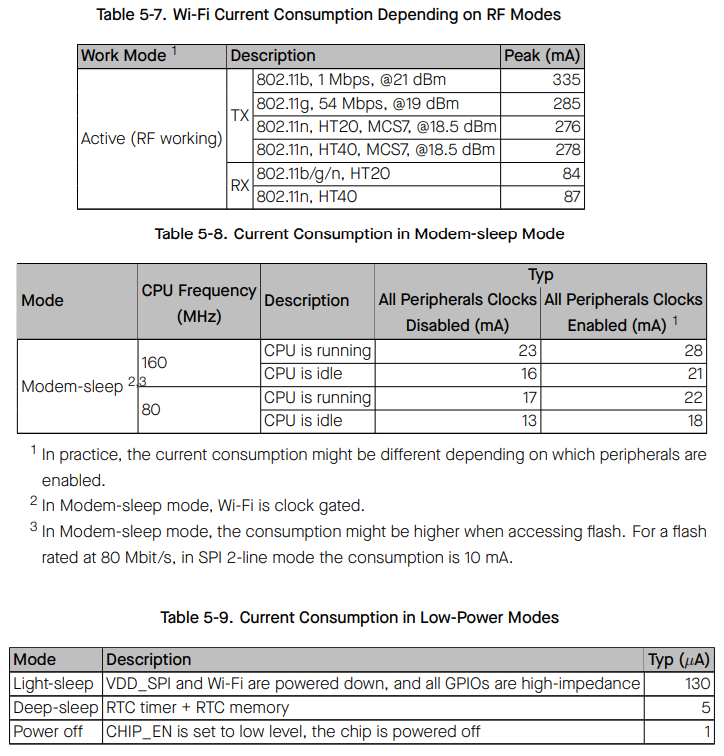

# Seeed Studio XIAO ESP32C3 µFL

https://wiki.seeedstudio.com/XIAO_ESP32C3_Getting_Started/

- ESP32-C3
  - https://www.espressif.com/sites/default/files/documentation/esp32-c3_datasheet_en.pdf
  - Processeur mono coeur RISC-V 32 @160Mhz
  - Communication 
    - Wifi 802.11b/g/n 2.4 Ghz
    - BlueTooth 5 compatible Mesh
    - Antenne µFL
  - Mémoire µC
    - 384 Kb ROM
    - 400 Kb SRAM
    - 8 kb SRAM RTC FAST Memory
  - Acceleration Cryptographique
- Mémoire Carte
  - 4 Mb FLASH
- 1x LED de charge
- Chargeur Batterie LIPO
- Consommation carte
  - Light Sleep = 3mA
  - Deep Sleep = 43µA

## Functional_Block_Diagram

    

## Power_Consumption of ESP32-C3

    

[Retour]

[Retour]: ../Readme.md
