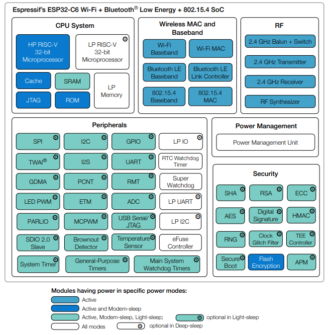
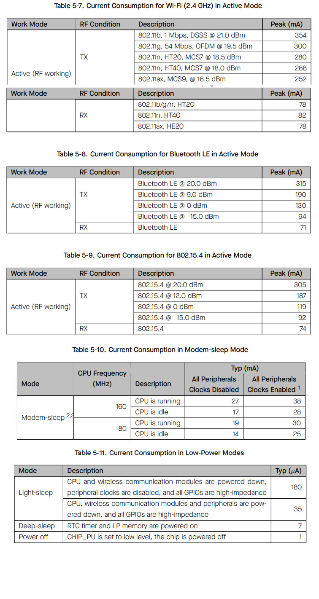

# Seeed Studio XIAO ESP32C3 µFL

https://wiki.seeedstudio.com/xiao_esp32c6_getting_started/

- ESP32-C6
  - https://www.espressif.com/sites/default/files/documentation/esp32-c6_datasheet_en.pdf
  - Processeur double coeur RISC-V 32 @160Mhz + RISC-V 32 LP @20Mhz
  - Communication 
    - Wifi 6 802.11b/g/n/ax 2.4 Ghz
    - BlueTooth 5.3 compatible BLE  & Mesh
    - ZigBee
    - Thread (802.15.4) Matter
    - Antenne µFL
  - Mémoire µC
    - 384 Kb ROM
    - 512 Kb SRAM
    - 16 kb LP SRAM
  - Acceleration Cryptographique
- Mémoire Carte
  - 4 Mb FLASH
- 1x LED de charge
- 1x LED configurable
- Chargeur Batterie LIPO
- Consommation carte
  - Light Sleep = 2,5mA
  - Deep Sleep = 15µA

## Functional_Block_Diagram

    

## Power_Consumption of ESP32-C6

    

[Retour]

[Retour]: ../Readme.md
