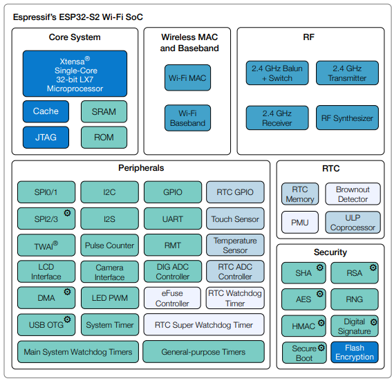
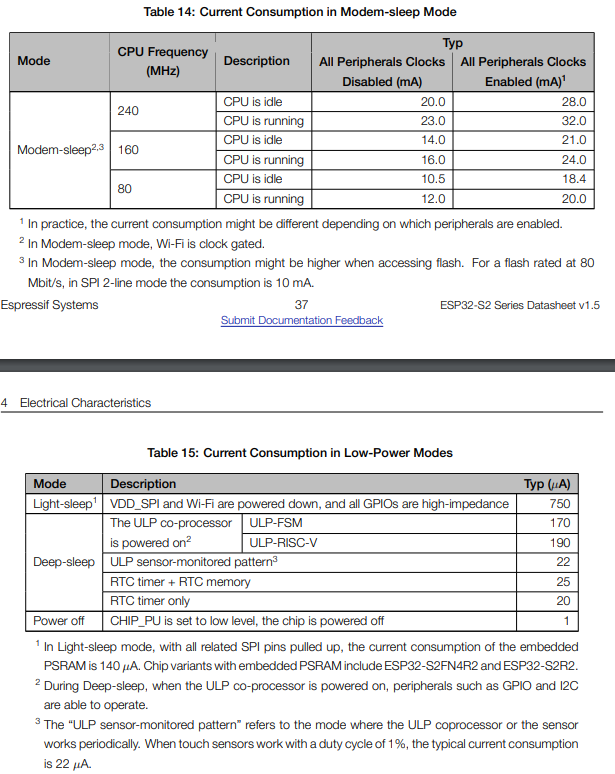

# ESP32-S2 QT Py de Adafruit µFL
- https://learn.adafruit.com/adafruit-qt-py-esp32-s2/overview
- ESP32-S2F
    - https://www.espressif.com/sites/default/files/documentation/esp32-s2_datasheet_en.pdf
    - ESP32-S2 embedded, Xtensa® single-core 32-bit LX7 microprocessor, up to 240 MHz
    - Flash RAM: 4 Mo
    - PSRAM: 2MB
- Wifi & BLE
- 1x LED RGB adressable NeoPixel
- 1x connecteur STEMMA QT pour l'I2C
- USB natif pris en charge par tous les systèmes d'exploitation 
    - MIDI, clavier/souris HID, 
    - peut être utilisé dans Arduino ou CircuitPython comme console série USB, 
    - Même un petit lecteur de disque pour stocker les scripts Python
- Antenne µFL

- Functional_Block_Diagram
<p >
    
</p>

- Power_Consumption
<p >
    
</p>

```
; Environnement dans platform.ini
[env:adafruit_qtpy_esp32s2]
platform = espressif32
board = adafruit_qtpy_esp32s2
framework = arduino
```

[Retour]

[Retour]: ../Readme.md

