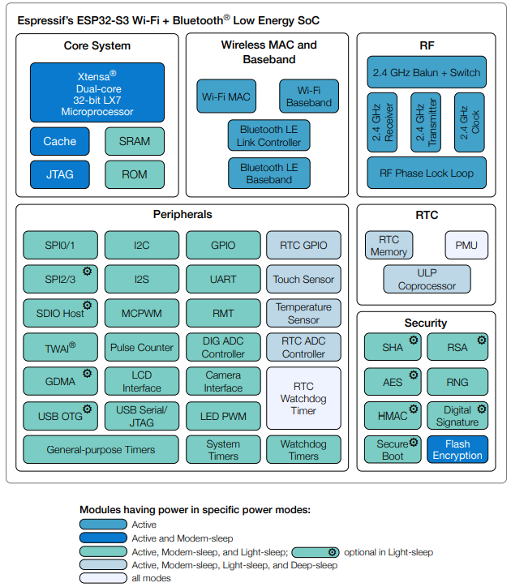
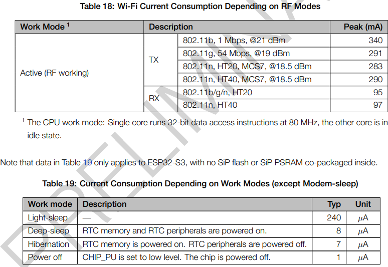

# ESP32-S2 QT Py de Adafruit µFL

https://learn.adafruit.com/adafruit-qt-py-esp32-s3/overview

- ESP32-S3
  - https://cdn-shop.adafruit.com/product-files/5426/esp32-s3_datasheet_en.pdf
  - Processeur double coeur 32bit LX7 Xtensa à 240/160/80/40 Mhz
  - Communication 
    - Wifi 802.11b/g/n 2.4Ghz
    - BlueTooth **uniquement** en BLE
    - Antenne µFL
  - Mémoire µC
    - 128 Kb ROM
    - 320 Kb SRAM
    - 8 kb SRAM RTC FAST Memory
    - 4 kb Efuse (Eprom)
  - Acceleration Cryptographique
- Mémoire Carte
  - 4 Mb FLASH
  - 2 Mb PSRAM  
- 1x LED RGB adressable NeoPixel
- 1x connecteur STEMMA QT pour l'I2C
- USB natif
- Pads d'entrée de batterie jusqu'à 6 V
- Consommation carte
  - Light Sleep = 4mA
  - Deep Sleep = 70µA

## Functional_Block_Diagram

    

## Power_Consumption of ESP32-S3

    

[Retour]

[Retour]: ../Readme.md

