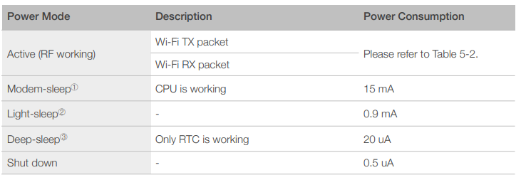

# ESP8266-01 EX
- https://www.espressif.com/sites/default/files/documentation/0a-esp8266ex_datasheet_en.pdf
- Tensilica L106 32-bit RISC processor, clock speed of 160 MHz
- Flash RAM: 80KB
- SRAM: 1MB
- Wifi (pas de BT)
- PInOUT : https://randomnerdtutorials.com/esp8266-pinout-reference-gpios/

- Functional_Block_Diagram
<p >
    
</p>

- Power_Consumption
<p >
    
</p>

- Programmateur ESP8266: https://www.gotronic.fr/pj2-35183-1542.pdf
- Fiche Technique Module Relais: https://www.gotronic.fr/pj2-sbc-esp01-rm-datasheet-2021-05-05-2715.pdf


```
; Environnement dans platform.ini
[env:esp01_1m]
platform = espressif8266
board = esp01_1m
framework = arduino
```

[Retour]

[Retour]: ../Readme.md