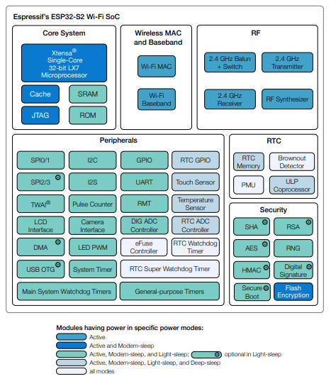
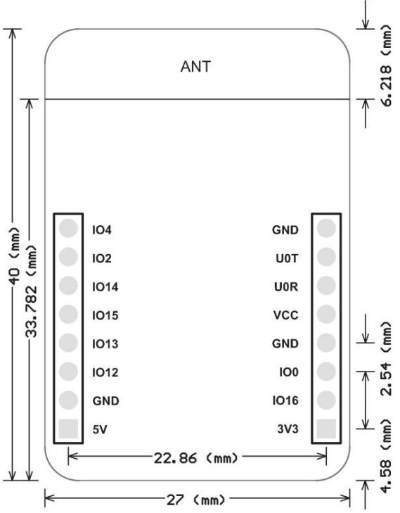
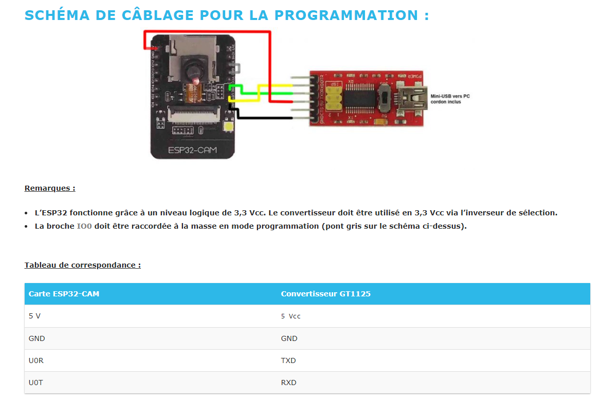

# ESP32CAM AI THINKER
- https://www.gotronic.fr/blog/guides/utilisation-du-module-eps32-cam-avec-arduino/
- ESP32-S2 embedded
    - https://www.espressif.com/sites/default/files/documentation/esp32-s2_datasheet_en.pdf
    - Xtensa® single-core 32-bit LX7 microprocessor, up to 240 MHz
    - Flash RAM: 320KB
    - PSRAM: 4MB
    - Wifi & BLE
- Capteur OV2640
- LED blanche CMS haute luminausité Flashlight (GPIO 4)
- Lecteur de carte micro-SD 4 Go maxi
- Antenne µFL
- PInOUT : https://randomnerdtutorials.com/esp32-cam-ai-thinker-pinout/
    - Broches partagées par le lecteur micro-SD: IO2, IO4, IO12, IO13, IO14 et IO15
    - IO0 : Si à l'état bas lors du boot, passage en mode programmation
    - IO3 IO1 : RX / TX de la liasion série pour la programmation et moniteur série
    - IO4: pilotage de la FlashLED avec une résistance de PullUp de 47K et une de PullDown de 10+1K qui pilote un transistor
    - IO13: possède une résistance de PullUp de 47k
    - IO12: détermine la valeur de VDD_SDIO (tension de la mémoire flash), doit être à l'état bas au démarrage
    - IO16: partagée avec la broche CS de la PSRAM, !!! à éviter


- Functional_Block_Diagram
<p >
    
</p>

- Dimensions
<p >
    
</p>


- Programmateur FT232RL GT1125: https://www.gotronic.fr/pj2-35183-1542.pdf
    - driver Windows: https://ftdichip.com/drivers/vcp-drivers/
<p >
    
</p>

```
; Environnement dans platform.ini
[env:esp32cam]
platform = espressif32
board = esp32cam
framework = arduino
```

[Retour]

[Retour]: ../Readme.md
